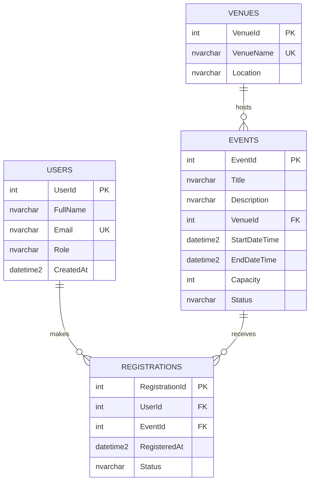

# Group Hands-On Laboratory Examination – SUBMISSION

**Course:** Applied Generative AI for IT Solution Development (WPH Academy)
**Section:** BIT42 – MidtermSummativeLaboratory
**System:** Online Campus Event Management System (prototype)

---

## Team Roster

| Member | Name | Assigned Role | Core Responsibilities |
|---|---|---|---|
| Member 1 | Jose Pintor (Gab) | Systems Architect, Prompt Lead & Database/Backend Engineer | Task 1, Task 3, Task 5, and Task 4 (security diagnosis and refactor) |
| Member 2 | Arjan Sarinas | Frontend Engineer & QA Engineer | Task 2, and Task 4 (unit tests) |

Group size is 2, so the Member 3 and Member 4 responsibilities are absorbed as shown above.

## Setup Instructions

```text
git clone https://github.com/jopintor/BIT42PintorSarinasLaboratoryMidterm.git
cd BIT42PintorSarinasLaboratoryMidterm
```

| Part | How to run / view |
|---|---|
| Frontend (`/frontend`) | Double-click `frontend/index.html`, or run `npx serve frontend` and open the URL shown. No build step, no dependencies. |
| Database (`/database/schema.sql`) | Open in SSMS or Azure Data Studio connected to SQL Server and run it. It creates `CampusEventDB`, tables, constraints, indexes, and sample data. CLI: `sqlcmd -S localhost -E -i database/schema.sql` |
| Backend (`/backend`) | Requires .NET 8 SDK. Run `dotnet build backend`. Pass the connection string via configuration, never hard-code it. |
| Unit tests (`/tests`) | `dotnet test tests/RegistrationValidator.Tests` |
| ERD | Mermaid block below renders on GitHub, or paste it at https://mermaid.live |

---

## Task 1 – Requirements Analysis & Prompt Architecture

### Exact Prompt (RCTC)

```text
ROLE
You are a Lead Systems Architect with 15 years of experience designing web-based information systems for universities. You favor simple, buildable designs over fashionable ones.

CONTEXT
A team of 3-4 fourth-year BSIT students has exactly 3 hours to build a working prototype of an Online Campus Event Management System. The system must let students (1) view upcoming campus events, (2) register for an event, and let administrators (3) view the list of registered attendees. The team knows HTML/CSS/JavaScript, C# (.NET), and SQL Server. They are beginners with generative AI tools. Work is split among a Systems Architect, a Frontend Engineer, a Database/Backend Engineer, and a QA/Security Engineer, and shared through one GitHub repository.

TASK
Produce an overall system design that includes:
1. A one-paragraph architecture summary and a layered component diagram described in text.
2. Functional and non-functional requirements (max 8 each), including accessibility (WCAG) and security.
3. The tech stack with a one-line justification for each choice.
4. A proposed folder structure for the repository (/frontend, /backend, /database, /tests).
5. A list of the main entities and their relationships (no SQL yet).
6. The key REST endpoints (method, path, purpose).
7. A realistic 180-minute build timeline per team member.
8. The top 5 risks and how to reduce each.

CONSTRAINTS
- Do NOT use third-party state management libraries such as Redux.
- Do NOT propose microservices, message queues, Kubernetes, or any cloud-managed service that needs billing setup.
- Do NOT use frontend frameworks that require a build step; use semantic HTML5, CSS, and vanilla JavaScript.
- Do not invent features beyond the three stated requirements (no payments, no QR check-in).
- Keep the entire response under 900 words, use headings and tables, and use plain language.
- If any requirement is ambiguous, state your assumption explicitly instead of guessing silently.
```

### AI Output (paste exactly as generated)

> **Tool / model used:** Gemini (Google)  **Date:** October 10, 2026
> The prompt above was used exactly as written. The response below is reproduced in full; only Markdown formatting (line breaks, tables, code fences) was restored after copying.

````markdown
# Explicit Assumptions
- Student authentication is omitted due to the 3-hour constraint; students submit their Name, Email, and Student ID directly per registration.
- Admin access uses a simple pre-shared key header (X-Admin-Key) to avoid complex identity scaffolding.

# 1. Architecture Summary & Layered Component Diagram
The system uses a lightweight 3-tier monolithic architecture optimized for rapid local development without build tooling. The presentation tier consists of static HTML5, CSS, and Vanilla JavaScript running natively in the browser. It communicates via HTTP/JSON REST endpoints with a monolithic ASP.NET Core Minimal API backend. The backend executes business logic and accesses a local SQL Server instance using Dapper for simple, fast data mapping.

```plaintext
+-------------------------------------------------------------+
| Presentation Layer (Browser)                                |
|   - Vanilla HTML5 / CSS3 / JavaScript (Fetch API)           |
+-------------------------------------------------------------+
                               |
                               | REST over HTTP (JSON)
                               v
+-------------------------------------------------------------+
| Application / Backend Layer (.NET ASP.NET Core API)         |
|   - Controllers / Minimal API Endpoints                     |
|   - Business & Validation Rules                             |
|   - Dapper ORM / Data Access                                |
+-------------------------------------------------------------+
                               |
                               | ADO.NET Connection
                               v
+-------------------------------------------------------------+
| Data Layer (SQL Server Database)                            |
|   - Events Table                                            |
|   - Registrations Table                                     |
+-------------------------------------------------------------+
```

# 2. Requirements
## Functional Requirements
1. Students shall view a list of all upcoming campus events.
2. Students shall view details for a single selected campus event.
3. Students shall submit registration for an event using Name, Email, and Student ID.
4. The system shall block duplicate registrations for the same Student ID on a single event.
5. Administrators shall view the list of registered attendees for any selected event.
6. The system shall return visual success or error feedback for all user actions.

## Non-Functional Requirements
1. Performance: API endpoints must return responses within 2 seconds under local test conditions.
2. Accessibility (WCAG 2.1 AA): All form fields must include associated <label> elements and maintain a visual contrast ratio of at least 4.5:1.
3. Accessibility (Keyboard): All interactive elements must be fully navigable using the Tab key.
4. Security (SQLi): Database queries must use parameterized SQL statements exclusively.
5. Security (XSS): User input rendered on the UI must be escaped before insertion into the DOM.
6. Security (CORS): Backend CORS policy must be restricted to the exact origin of the static frontend.
7. Compatibility: System must function on modern evergreen browsers (Chrome, Edge, Firefox) without plugins.

# 3. Tech Stack
| Component | Technology | Justification |
|---|---|---|
| Frontend | Vanilla HTML5, CSS3, JS | Zero setup time and eliminates complex node build steps. |
| Backend | ASP.NET Core Minimal API | Fastest C# framework to bootstrap lightweight REST endpoints. |
| Data Access | Dapper | High-performance micro-ORM requiring zero configuration mapping. |
| Database | SQL Server (LocalDB/Express) | Standard database tool integrated directly into C# tooling. |
| Testing | Visual Studio .http / Postman | Allows instant API endpoint testing without frontend dependencies. |

# 4. Proposed Folder Structure
```plaintext
/
├── frontend/
│   ├── index.html       # Student Event Catalog & Details
│   ├── admin.html       # Admin Attendee Viewer
│   ├── style.css        # Shared Styles
│   └── app.js           # API Fetch Logic & DOM Manipulation
├── backend/
│   ├── Program.cs       # Minimal API Routes & App Setup
│   ├── Models.cs        # Event & Registration DTOs
│   └── appsettings.json # DB Connection String
├── database/
│   └── schema.sql       # DDL Script for DB & Tables Creation
└── tests/
    └── requests.http    # Integration API Test Script
```

# 5. Main Entities & Relationships
- **Event**
  - Attributes: EventId, Title, Description, EventDate, Capacity
  - Relationship: One Event has many Registrations.
- **Registration**
  - Attributes: RegistrationId, EventId, StudentId, StudentName, StudentEmail, RegisteredAt
  - Relationship: Belongs to exactly one Event. Unique constraint on (EventId, StudentId).

# 6. Key REST Endpoints
| Method | Path | Purpose |
|---|---|---|
| GET | /api/events | Fetch all upcoming events. |
| GET | /api/events/{id} | Fetch detailed information for a single event. |
| POST | /api/events/{id}/register | Submit student event registration. |
| GET | /api/events/{id}/attendees | Fetch list of registered students for an event (Admin). |

# 7. Realistic 180-Minute Build Timeline
| Time | Systems Architect | Frontend Engineer | Backend Engineer | QA/Security Engineer |
|---|---|---|---|---|
| 0–30m | Set up GitHub repo & folder structure | HTML skeletons (index.html, admin.html) | Execute schema.sql on SQL Server | Draft manual test cases & configure .http file |
| 30–90m | Implement CORS & global exception handlers | CSS styling & JavaScript fetch() setup | Build GET /events & POST /register APIs | Execute SQLi & XSS security checks on API endpoints |
| 90–140m | Coordinate FE/BE API integration | Wire up event registration forms & feedback UI | Build GET /attendees admin API | Test edge cases (e.g., duplicate registration prevention) |
| 140–180m | Perform end-to-end smoke test & lead demo prep | Fix WCAG contrast & keyboard navigation | Fix backend bugs & edge-case validation | Verify accessibility & validate end-to-end user flows |

# 8. Top 5 Risks & Mitigations
| # | Risk | Mitigation |
|---|---|---|
| 1 | CORS execution errors | Configure explicit AllowAnyOrigin() middleware in ASP.NET Core during minute 0–30. |
| 2 | Database connection failures | Use a single shared connection string pointing to (localdb)\mssqllocaldb in appsettings.json. |
| 3 | Git merge conflicts | Enforce clear directory ownership: each role edits only their designated folder. |
| 4 | SQL Injection / XSS vulnerabilities | Mandate Dapper parameterized queries and use textContent instead of innerHTML in JS. |
| 5 | Scope creep & missing time | Block any unrequested features (e.g., login screens, dark mode) during code reviews. |
````

### Manual Grounding Evaluation

> The AI-generated architecture is realistic for a 3-hour prototype because it uses a simple three-tier design (vanilla HTML/CSS/JS, an ASP.NET Core Minimal API, and SQL Server) with no build tooling, microservices, or banned state-management libraries. We checked its 180-minute timeline against the exam's task durations and confirmed that directory ownership per role keeps parallel work manageable. However, it contradicted itself on security by recommending `AllowAnyOrigin()` for CORS in its risk table while also requiring CORS to be limited to the frontend's exact origin, so we replaced it with a restricted-origin policy. We also scoped down its separate `admin.html` page and Student ID field to fit our single-page frontend and normalized schema, which keeps the final design buildable within three hours.

---

## Task 2 – AI-Assisted Frontend (`/frontend/index.html`)

**Tool used:** Claude (Anthropic)

### Exact Prompt

```text
Act as a senior frontend engineer who specializes in accessibility. Build a single-file prototype (index.html with inline CSS and vanilla JavaScript, no frameworks, no external dependencies) for an Online Campus Event Management System with:
1) an Event Catalog showing each event as a card (title, date/time, venue, seats left, banner image with alt text);
2) a Registration Form (full name, student email that must end in @univ.edu.ph, event dropdown);
3) an administrator table listing registered attendees.
Requirements: use semantic HTML5 (<header>, <main>, <section>, <article>, <footer>) instead of generic <div> wrappers; follow WCAG POUR: a <label> and aria-label on every input, aria-describedby for hints, aria-live for status messages, visible focus styles, color contrast of at least 4.5:1, a skip link, and alt text on every image. Build DOM nodes with textContent, never innerHTML with user data. Do not add libraries or CDNs.
```

### Output
Final code committed at [`/frontend/index.html`](frontend/index.html).

### Accessibility checklist (POUR)

| Principle | Implementation |
|---|---|
| Perceivable | `alt` text on every event image; text/background contrast above 4.5:1; labels visible, not placeholder-only |
| Operable | Full keyboard use; skip link; visible `:focus-visible` outline; scrollable table region is focusable |
| Understandable | `lang="en"`; hint text for email format; plain-language error messages; `aria-invalid` on bad input |
| Robust | Semantic tags; `aria-label`, `aria-describedby`, `aria-live`; table uses `<caption>` and `scope` attributes |

---

## Task 3 – Database Design & ERD

### Exact Prompt

```text
Act as a senior database architect. Design a Third Normal Form (3NF) schema for an Online Campus Event Management System on SQL Server with at least these entities: Users, Venues, Events, Registrations.
Deliver: (1) a short normalization justification (why each table is in 3NF); (2) an Entity-Relationship Diagram as a Mermaid.js erDiagram code block; (3) a production-grade T-SQL DDL script that includes primary keys, FOREIGN KEY constraints with explicit ON DELETE / ON UPDATE rules, CHECK constraints (positive capacity, end after start, valid status values, email domain @univ.edu.ph), a UNIQUE constraint to prevent double registration, and explicit NON-CLUSTERED indexes on every foreign key column. Make the script re-runnable. Add a few sample rows and one admin query listing attendees per event.
```

### 3NF Justification
- **Users:** every column depends only on `UserId` (name, email, role).
- **Venues:** venue details live once here; `Events` holds only `VenueId`, so no transitive dependency on venue name or location.
- **Events:** every column depends on `EventId`.
- **Registrations:** a junction table resolving the many-to-many between Users and Events; user and event details are not repeated here.

**Refinement of the Task 1 design:** the Task 1 output stored `StudentName` and `StudentEmail` directly in `Registrations`. Our schema moves them into a separate `Users` table and adds `Venues`, so no student or venue detail is repeated across rows (3NF).

### ERD (Mermaid.js)



### DDL Script
Saved at [`/database/schema.sql`](database/schema.sql). Highlights: `FK_*` with explicit `ON DELETE`/`ON UPDATE`; `CK_Events_Capacity`, `CK_Events_Dates`, `CK_Users_Email`, `CK_Registrations_Status`; `UQ_Registrations_User_Event`; non-clustered indexes `IX_Events_VenueId`, `IX_Registrations_UserId`, `IX_Registrations_EventId`.

---

## Task 4 – Shift-Left Testing, Security & Refactoring

### 4.1 Unit Test Prompt

```text
Act as a QA engineer. Write xUnit tests with Moq for a C# class RegistrationValidator that (a) validates student emails must end in @univ.edu.ph (case-insensitive, trimmed) and (b) checks seat availability, duplicate registration, and unknown events using an IEventRepository dependency. Mock IEventRepository so no database is touched. Include edge cases: null, empty, whitespace, wrong domain, spoofed domain like ana@univ.edu.ph.evil.com, full event, duplicate registration. Verify that the repository is never called when the email is invalid.
```

Files: [`/backend/RegistrationValidator.cs`](backend/RegistrationValidator.cs) and [`/tests/RegistrationValidator.Tests/RegistrationValidatorTests.cs`](tests/RegistrationValidator.Tests/RegistrationValidatorTests.cs). Run with `dotnet test tests/RegistrationValidator.Tests`.

### 4.2 Flawed Code Given

```csharp
public string GetUserRegistration(string inputEmail) {
   string connStr = "Server=myServerAddress;Database=myDataBase;User Id=myUsername;Password=myPassword;";
   SqlConnection conn = new SqlConnection(connStr);
   conn.Open(); // Connection is not closed or disposed
   SqlCommand cmd = new SqlCommand("SELECT * FROM Registrations WHERE Email = '" + inputEmail + "'", conn);
   return cmd.ExecuteScalar().ToString();
}
```

### 4.3 Diagnosis Prompt

```text
Act as an application security reviewer. Diagnose this C# method for (1) SQL injection risks, (2) unmanaged resource / memory leaks, and (3) any other bad practice. For each issue give: severity, why it is dangerous, and an example attack or failure. Then do not rewrite the code yet.
<paste the flawed method>
```

### Diagnosis Results
*Diagnosis performed with Claude (Anthropic).*


| # | Issue | Severity | Why it matters |
|---|---|---|---|
| 1 | SQL injection: user input is concatenated into the query | Critical | Input like `' OR '1'='1` returns other users' data; `'; DROP TABLE Registrations;--` can destroy data |
| 2 | `SqlConnection` and `SqlCommand` are never disposed | High | Leaks connections; pool exhaustion makes the app stop responding |
| 3 | Hard-coded credentials in source | High | Secrets leak through GitHub |
| 4 | `ExecuteScalar()` can return null, then `.ToString()` throws | Medium | Unhandled `NullReferenceException` when no registration exists |
| 5 | `SELECT *` with `ExecuteScalar` | Low | Fetches unneeded columns; fragile if column order changes |

### 4.4 Refactored Solution
Saved at [`/backend/RegistrationService.cs`](backend/RegistrationService.cs): parameterized `SqlParameter`, `using` declarations for connection and command, connection string injected, null-safe return, input validation.

---

## Task 5 – Group Integration & Verification

### AI Disclosure Statement

| AI Tool | Used for | How output was verified |
|---|---|---|
| Claude (Anthropic) | Task 2 UI code, Task 3 schema / ERD / DDL, Task 4 unit tests, vulnerability diagnosis and refactor, and the SUBMISSION.md template | Reviewed the code line by line; opened `index.html` in a browser and tested with keyboard only; ran `schema.sql` on SQL Server; rendered the ERD at mermaid.live; ran `dotnet test`; checked the refactor against SQL injection and resource-disposal best practices |
| Gemini (Google) | Task 1 system design output | Compared the architecture and timeline against the exam constraints and task durations; found the CORS contradiction and the schema mismatch listed in the Verification Log |

All prompts are recorded in this document. No AI output was committed without review by the member responsible for that task.

### Group Verification Log

| Task # | Identified AI Flaw / Limitation | Manual Correction Applied | Member Responsible |
|---|---|---|---|
| Task 1 | The risk table recommended `AllowAnyOrigin()` for CORS, which contradicts the AI's own security requirement to restrict CORS to the frontend's exact origin | Replaced it with a restricted policy using `WithOrigins("http://localhost:5500")` | Member 1 |
| Task 1 | The AI's `Registration` entity stored `StudentName` and `StudentEmail` directly, repeating student data on every row (not 3NF) | Moved student data into a separate `Users` table and added `Venues` in the Task 3 schema | Member 1 |
| Task 1 | The timeline left WCAG fixes and exception handling until the final 40 minutes, which is risky | Built labels, ARIA attributes, contrast, and keyboard support into the Task 2 UI from the start, and used input validation and null-safe returns in the C# service | Member 2 |
